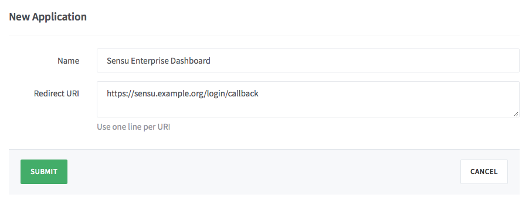
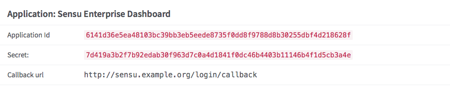

**ENTERPRISE: Role based access controls are available for [Sensu Enterprise][5]
users only.**

## RBAC for GitLab (driver)

### Reference Documentation

- [What is RBAC for GitLab?](#what-is-rbac-for-gitlab)
- [RBAC for GitLab configuration](#rbac-for-gitlab-configuration)
  - [Example RBAC for GitLab definition](#example-rbac-for-gitlab-definition)
  - [RBAC for GitLab definition specification](#rbac-for-gitlab-definition-specification)
    - [`gitlab` attributes](#gitlab-attributes)
    - [`roles` attributes](#roles-attributes)
- [Register an OAuth Application in GitLab](#register-an-oauth-application-in-gitlab)

## What is RBAC for GitLab?

The Sensu Enterprise Dashboard offers support for built-in [Role Based Access
Controls (RBAC)][0], which depends on using some external source of truth for
authentication. The Sensu Enterprise Dashboard RBAC for GitHub driver provides
support for using [GitLab][1] for RBAC authentication.

## RBAC for GitLab configuration

### Example RBAC for GitLab definition

~~~ json
{
  "dashboard": {
    "host": "0.0.0.0",
    "port": 3000,
    "...": "",
    "gitlab": {
      "applicationId": "6141d36e5ea48103bc39bb3eb5eede8735f0dd8f9788d8b30255dbf4d218628f",
      "secret": "7d419a3b2f7b92edab30f963d7c0a4d1841f0dc46b4403b11146b4f1d5cb3a4e",
      "server": "https://gitlab.com",
      "redirecturl": "https://sensu.example.org/login/callback",
      "roles": [
        {
          "name": "guests",
          "members": [
            "myorganization/guests"
          ],
          "datacenters": [
            "us-west-1"
          ],
          "subscriptions": [
            "webserver"
          ],
          "readonly": true
        },
        {
          "name": "operators",
          "members": [
            "myorganization/operators"
          ],
          "datacenters": [],
          "subscriptions": [],
          "readonly": false
        }
      ]
    }
  }
}
~~~

### RBAC for GitLab definition specification

#### `gitlab` attributes

applicationid
: description
  : The GitLab OAuth Application "Application Id"
   _NOTE: requires [registration of an OAuth application in GitLab][2]._
: required
  : true
: type
  : String
: example
  : ~~~shell
    "applicationid": "6141d36e5ea48103bc39bb3eb5eede8735f0dd8f9788d8b30255dbf4d218628f"
    ~~~

secret
: description
  : The GitLab OAuth Application "Secret"
  _NOTE: requires [registration of an OAuth application in GitLab][2]._
: required
  : true
: type
  : String
: example
  : ~~~shell
    "secret": "7d419a3b2f7b92edab30f963d7c0a4d1841f0dc46b4403b11146b4f1d5cb3a4e"
    ~~~

server
: description
  : The location of the GitLab server you wish to authenticate against.
: required
  : true
: type
  : String
: example
  : ~~~shell
    "server": "https://gitlab.com"`
    ~~~

redirecturl
: description
  : The GitLab OAuth Application "Callback url"
  _NOTE: requires [registration of an OAuth application in GitLab][2]._
: required
  : true
: type
  : String
: example
  : ~~~shell
    "redirecturl": "https://sensu.example.org/login/callback"
    ~~~

roles
: description
  : An array of [`roles` definitions][3].
: required
  : true
: type
  : Array
: example
  : ~~~shell
    "roles": [
      {
        "name": "guests",
        "members": [
          "guests"
        ],
        "datacenters": [
          "us-west-1"
        ],
        "subscriptions": [
          "webserver"
        ],
        "readonly": true
      },
      {
        "name": "operators",
        "members": [
          "operators"
        ],
        "datacenters": [],
        "subscriptions": [],
        "readonly": false
      }
    ]
    ~~~

#### `roles` attributes

Please see the [RBAC definition specification][4] for information on how to
configure RBAC roles.

## Register an OAuth Application in GitLab

To use GitLab for authentication requires registration of your Sensu Enterprise
Dashboard as a GitLab "application". Please note the following instructions:

1. To register a GitLab OAuth application, please navigate to your GitLab
  profile section and selection "Applications" => "New application".

    

2. Give your application a name (e.g. "Sensu Enterprise Dashboard")

3. Provide the Authorization callback URL (e.g. `{HOSTNAME}/login/callback`)

    _NOTE: this URL does not need to be publicly accessible - as long as a user
    has network access to **both** GitLab **and** the callback URL, s/he will
    be able to authenticate; for example, this will allow users to authenticate
    to a Sensu Enterprise Dashboard service running on a private network as long
    as the user has access to the network (e.g. locally or via VPN)._

4. Select "Submit" and note the application Application Id and Secret.

    

[?]:  #
[0]:  ../role-based-access-controls.html
[1]:  https://gitlab.com
[2]:  #register-an-oauth-application-in-gitlab
[3]:  #roles-attributes
[4]:  overview.html#roles-attributes
[5]:  /enterprise
