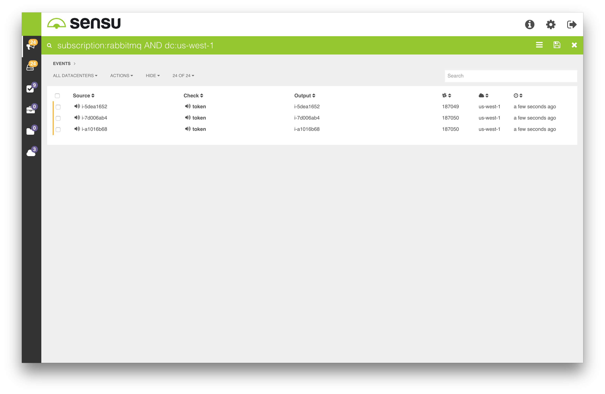

# Sensu Enterprise Dashboard

Sensu Enterprise ships with a dashboard that provides a "single-pane of glass" for one or more Sensu Enterprise installations. The Sensu Enterprise Dashboard provides real-time visibility into Sensu Enterprise data including dedicated views for events, clients, checks, and datacenters (i.e. Sensu Enterprise installations). The Sensu Enterprise Dashboard also provides mechanisms for silencing Sensu checks and/or clients, and powerful global search features for filtering views so users can see just the data that's important to them.

## Objectives

What will be covered in this documentation:

- Configuration of the Sensu Enterprise Dashboard
- How to enable Role-Based Access Controls
- Configuration of Audit Logging
- How to use the global search features (Collections)
